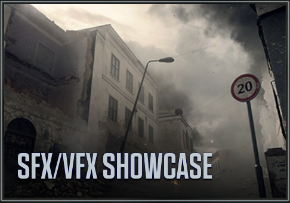

# SFX / VFX Showcase



An in-game asset browser for **Battlefield 6 Portal**. Browse, search, audition and
place every sound and visual effect the Portal SDK exposes, and test the game's music
system, all from the portal gadget. No Godot, no map editing, no SDK export: add two
files to any experience and play.

- **936 sounds** and **312 visual effects**, plus 4 player-wide screen effects, in
  113 groups
- **Search** with an on-screen keyboard, filter chips and one-click name prefixes
- **Favourites** you can export as a list of asset names to paste into your own mod
- A **MUSIC / RADIO tester** for every Core, BR, Gauntlet and Radio event and
  parameter, with savable templates
- Works with mouse and keyboard, and with a controller (the selected button turns orange)

---

## Install

You need the two files in [`dist/`](dist):

| File | What it is |
|---|---|
| [`dist/bundle.ts`](dist/bundle.ts) | The mod script |
| [`dist/bundle.strings.json`](dist/bundle.strings.json) | Its string table |

1. Download both files.
2. Open your experience on **[portal.battlefield.com](https://portal.battlefield.com)**.
3. Add `bundle.ts` as the experience's script and `bundle.strings.json` as its strings.
   You can rename them (for example `SfxVfxShowcase.ts` and
   `SfxVfxShowcase.strings.json`).
4. Start the experience.

> **The strings file is required.** Portal shows text by looking up keys in the
> experience's strings file. Without it, every label in the menu reads
> `<unknown string>`.

> **Test music on any map except Portal Sandbox.** The game plays no scripted music
> on the Portal Sandbox map, from this mod or any other. Sounds and effects work
> everywhere.

---

## How to use it

You get the **portal gadget** every time you deploy. It is the only control you need.

| Input | What it does |
|---|---|
| **Aim** (right mouse / left trigger) | Opens the menu |
| **SELECT** on a row | Arms that asset |
| **Fire** (left mouse / right trigger) | Places the armed asset where you are looking (up to 100 m) |
| **CLOSE X** | Closes the menu |

With the menu closed, nothing from the mod is on screen.

### Browse sounds and effects

The **SOUND** and **VISUAL** tabs list the catalog, 8 rows per page.

| In a row | What it does |
|---|---|
| `+` | Adds it to FAVOURITES (`*` when saved; press again to remove) |
| `PLAY` / `STOP` | Auditions it now, without arming it. Player-wide effects toggle on and off |
| `SELECT` | Arms it for the gadget |

A one-shot sound's row shows how long it plays, for example `ONE 1.2s`. `17s+` means
the sound is at least that long. Sounds play for their whole length, and each player
can have 16 playing at once; past that, the oldest stops.

- **Group rail** (left): pick a group, page with `< GROUPS` / `GROUPS >`. `ALL`
  shows everything again.
- **SEARCH** opens an on-screen keyboard. Search ignores the group rail and matches
  both the readable name and the asset's enum name. **PREFIXES** on the keyboard
  adds common name starts (`UI`, `Soldier`, `Gadgets`...) in one click.
- **Filter chips**: `3D` / `2D` / `LOOP` / `ONE` for sounds, `WORLD` / `PLAYER`
  for effects.
- **Footer**: `AMPLITUDE` and `RANGE` for sounds, `SCALE` for effects. They apply to
  the next placement.
- **Cleaning up**: `STOP ALL` silences your sounds, `UNDO` removes your last effect,
  `DELETE ALL` removes all your effects. Each player can have 24 effects placed;
  past that, the oldest is removed.

### Favourites and EXPORT

The **FAVOURITES** tab lists what you saved with `+`, in order, sounds and effects
together. **EXPORT FAVOURITES** writes the list to the game's log as asset names
you can paste into your own code:

```
---- FAVOURITES (4) ----
SFX_Alarm | Alarm | SFX | LOOP
SFX_Destruction_Buildings_HouseCollapse_OneShot3D | Destruction_Buildings | SFX | 13.6s
FX_Airburst_Incendiary_Detonation | Airburst | VFX
FX_Vehicle_Wreck_PTV | Vehicle | VFX
---- END FAVOURITES ----
```

On PC the log is `PortalLog.txt` in `%TEMP%\Battlefield™ 6\`. Favourites last for
the match.

### Music and radio

**MUSIC**: pick a package with `<` / `>` (CORE, BR or GAUNTLET), a track with
`|<` / `>|`, set its params, then **PLAY**. PLAY loads the package first if needed
(about 5 seconds). While the track plays, param changes are sent live; before that,
they only change the numbers on screen, so nothing starts until you press PLAY.

**RADIO**: pick a channel and a track number, press **QUEUE TRACK**, then **PLAY**.
The line under the params shows the station's track range (for example
`TRACKS 0 to 9`). `NEXT TRACK` skips, `CLEAR QUEUE` empties the queue, and channel 4
plays by biome.

`FOR: ME` (the default) plays music for you only. `FOR: EVERYONE` plays it for the
whole lobby. **LAST CALL** shows the exact call that was sent.

**Templates**: `SAVE TEMPLATE` saves the setup on screen to FAVOURITES. A template
row has `OPEN` (put it back in the tester), `PLAY`, `STOP` and `*` (remove). EXPORT
writes templates as plain lines of names and values:

```
MUSIC TEMPLATE 1 | Core | Core_LastPhaseBegin | Core_IsWinning 0, Core_PhaseUrgency 0.5, Core_Sector 0, Core_Urgency 3 | volume 1
RADIO TEMPLATE 2 | channel 2 BF Themes | queue #3, #4, #7 | continue 1, loop 1 | volume 1
```

### Reporting a problem

Turn **DEBUG ON** in the header, reproduce the problem, and share the log. Every
button press is logged with the state it acted on.

The full guide, with every option and known limit, is in
[description.md](description.md).

---

## Known limits

- **Two assets are left out** because they crash the Portal instance when played:
  `SFX_Levels_Brooklyn_Spots_EmergencyExit_SimpleLoop3D` and
  `SFX_Levels_Brooklyn_Shared_Spots_Water_Splash_Head_SimpleLoop3D`.
- **A few names are spelled differently on screen** because the game masks some
  words with `#`: `MF` shows as `MFX` (the MF group as `MuzzleFlash`) and `Smoke` as
  `SmokeFX`. Exported names are unchanged.
- **Sound lengths come from recordings.** The SDK gives no length for a sound, so
  one-shot lengths are measured from tabbedscamper's in-game recordings (see
  Credits). 14 recordings filled their whole recording slot, so those sounds show as
  "at least" (`10s+`, `17s+`). Four one-shots have no usable recording and show plain
  `ONE`. Loops stop after 8 seconds.
- **Radio tracks have numbers, not names.** The SDK gives no song names.
- **Many players on the search keyboard at once** is the heaviest case: Portal's UI
  limits are comfortable up to about four players using it at the same time.

---

## Build from source

You only need this to change the mod. The files in `dist/` are always the latest
build.

**Requirements**: Node.js 24 or later, and these folders next to this repo:

```
<any folder>/
  SfxVfxShowcase/                    this repo
  main_resources/
    bf6-portal-utils-master/         https://github.com/deluca-mike/bf6-portal-utils
    bf6-portal-mod-types-master/     https://github.com/deluca-mike/bf6-portal-mod-types
    types_original/mod/index.d.ts    from the Portal SDK: code/types/mod/index.d.ts
    bf6-portal-ui-preview-main/      https://github.com/nadorjozsef/bf6-portal-ui-preview
                                     (only for the browser preview)
```

Then:

```bash
npm install
npm run build      # generate, typecheck, bundle to dist/, and run every check and test
npm run release    # build, then copy dist/ to SfxVfxShowcase.ts + SfxVfxShowcase.strings.json
npm run preview    # layout preview in the browser
```

`npm run build` fails on any broken check. The checks include strings that would not
display, buttons with no handler, and too many widgets created at once. They also
include replay tests that click through the menu and check the exact calls sent to
the game.

### Project layout

| Path | What it is |
|---|---|
| `src/index.ts` | Entry point: events, the gadget, button handling |
| `src/ui.ts` | The menu: tabs, rail, rows, search keyboard |
| `src/tester.ts` | The MUSIC / RADIO tester and templates |
| `src/scene.json` | Layout and colours of the whole menu, shared with the preview |
| `src/config.ts` | Tunable numbers |
| `src/*.gen.ts`, `src/catalog.ts` | Generated from the SDK by `tools/gen-*.mjs` |
| `tools/` | Generators, build checks and replay tests |
| `preview/` | Browser layout preview |
| `probe/` | A small music test mod used to check music behaviour in game |
| `docs/DEVELOPMENT.md` | Development notes: Portal quirks and why each check exists |

---

## Credits

This mod is built on **[bf6-portal-utils](https://github.com/deluca-mike/bf6-portal-utils)**
by [Michael De Luca (deluca-mike)](https://github.com/deluca-mike). It does a large
part of the work here:

| Module | Used for |
|---|---|
| `ui` | Every widget in the menu: containers, text and buttons, their clicks and the controller highlight |
| `sounds` | The menu click sounds |
| `timers` | Music loading waits, sound clean-up and deferred redraws |
| `events` | All game events (deploy, gadget aim and fire, button presses) |
| `logging` | The debug log |

The mod is bundled into one file with
**[bf6-portal-bundler](https://github.com/deluca-mike/bf6-portal-bundler)**, also by
deluca-mike, and the asset catalog is generated from the type definitions in
**[bf6-portal-mod-types](https://github.com/deluca-mike/bf6-portal-mod-types)**.
The browser preview uses
**[bf6-portal-ui-preview](https://github.com/nadorjozsef/bf6-portal-ui-preview)** by
nadorjozsef.

Sound lengths are measured from the in-game recordings of the
**[BF6 Portal SoundBoard](https://github.com/TabbedScamper/BF6_Portal_SoundBoard)** by
[tabbedscamper](https://github.com/TabbedScamper). Only the measured numbers are used
(`src/sound-lengths.json`, imported by `tools/import-lengths.mjs`); no audio is
included. To hear any sound before using it, try their soundboard:
https://tabbedscamper.github.io/BF6_Portal_SoundBoard/

bf6-portal-utils is included in `dist/bundle.ts` under the MIT License,
Copyright (c) 2026 Michael De Luca. Its license text is in
[THIRD_PARTY_LICENSES.md](THIRD_PARTY_LICENSES.md).

## License

[MIT](LICENSE). You are free to use, change and share this mod, including in your own
experiences.
